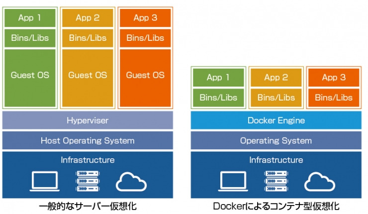

### Dockerとは何か?
- コンテナで仮想環境を作成したり実行するツール

### コンテナとは
-　箱のイメージで良い。その中(上)でアプリケーション(仮想環境)が動く

-　各コンテナは独立して実行される

### コンテナのメリット
- (Windows Homeとかで)一般的な仮想環境を利用する場合、それ専用のソフトウェアを動かし、その上で仮想OSが動く
  -> リソースが多く必要になるし、重い  
- コンテナ型を利用すると、軽量・高速に仮想環境を立ち上げ利用する事ができる

#### また、
「仮想マシン環境」では必ず「ゲストOS」が必要ですが、「コンテナ環境」ではアプリケーションを動かす際にサーバーOSのカーネル部分を、カーネル以外の部分はコンテナ自体のOSライブラリーを利用するため、ゲストOSを必要としません。
(https://and-engineer.com/articles/YZyl2REAACMAlPMj#heading2-2)
