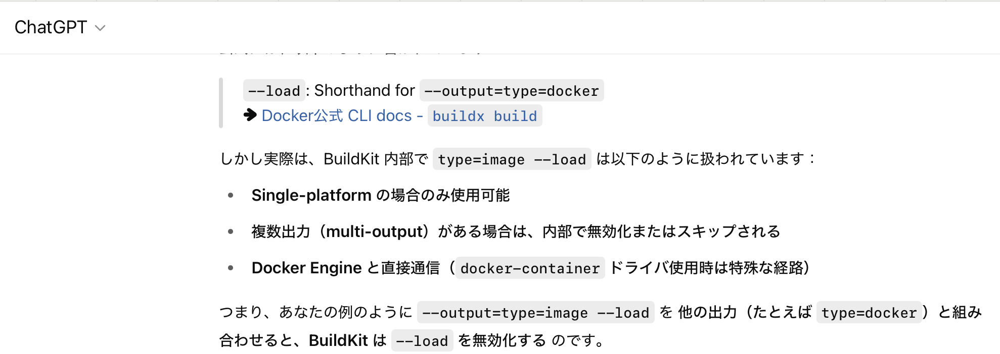

### 事象

- buildx を利用したイメージのビルドにて、1回のビルドで docker-archieve形式のイメージアーカイブと、local image store に出力しようとしても、local image store にビルド結果が出力されない

    ```docker
    docker buildx build \
    -o type=docker,dest=<出力先> \
    -o type=image --load \
    -t <イメージ名>:<タグ> \
    <build context>
    ```

    

<br>

- ちなみに、 `-o type=image` 記載しない場合も結果は同じ = 外部ファイルは出力されるが、local image store には保存されない

    ```docker
    docker buildx build \
    -o type=docker,dest=<出力先> \
    --load \
    -t <イメージ名>:<タグ> \
    <build context>
    ```
---

### 原因

- -- load オプションは --output type=docker のショートハンドラだが、 `-o type=docker`　オプションが他で指定されている場合、 --load は無視されるっぽい

    
---

### 解決策

- `--output type=docker `と `--output type=docker,dest=<出力先>` を指定する

    ```docker
    docker buildx build \
    --output tyoe=docker \ #destを省略 = local image store に出力する
    --output tyoe=docker,dest=<出力先> \ #destで出力先を指定
    -t <イメージ名>:<タグ>
    <build context>
    ```

    