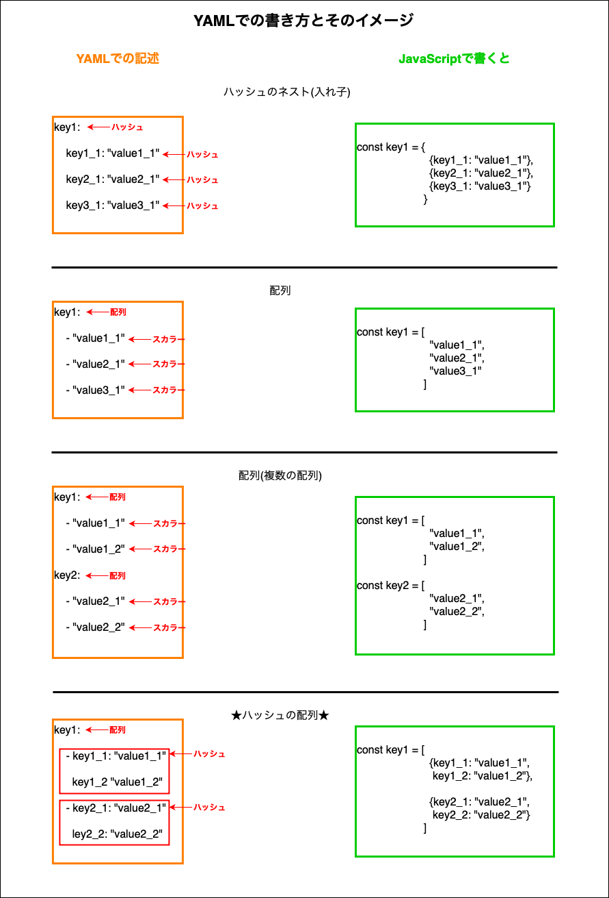

### YAMLファイルの基本

1. 基本的にはキー： 値の組み合わせ

 

2. キー:の後にスペースを必ず入れる

 

3. タブは使わない方がいいので「タブは使えない」と思った方がいい

 

4. 値部分にさらにキー: 値を書く場合は、改行し、1文字以上の空白を入れる

        キー:
          キー: 値

 

5.  配列を記述する場合は - (ハイフン) を先頭につける

        キー:
          - キー: 値
          - キー: 値

 

6. 文字列は''または""で囲む

 

7. コメントアウトは#

---

### ざっくりとした YAML の記述とそれが意味するイメージ

