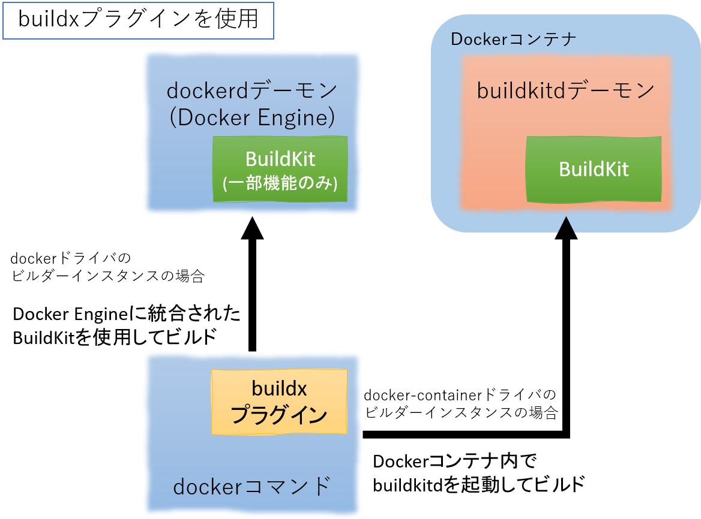
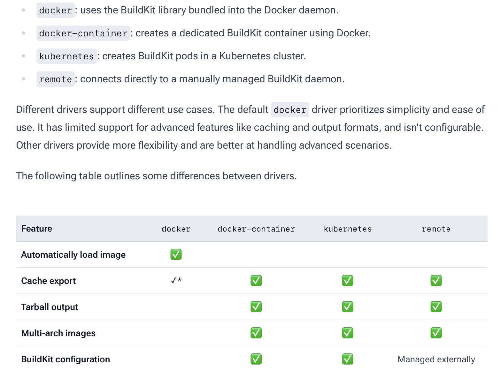
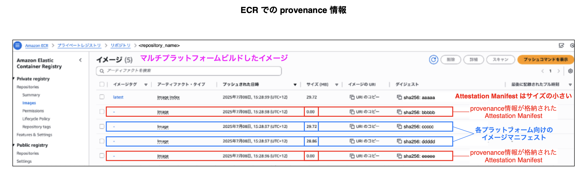
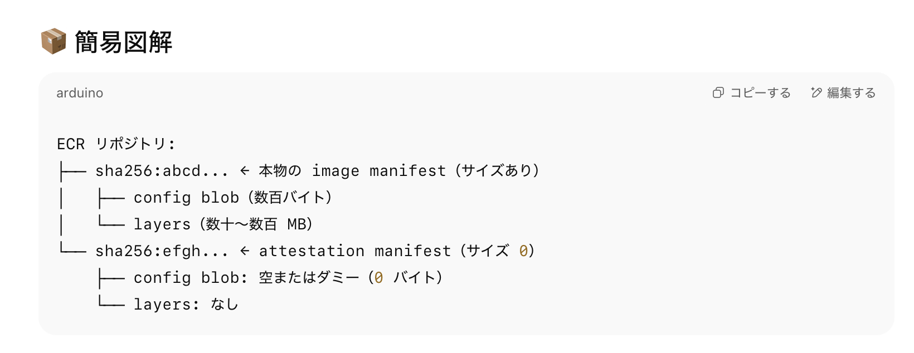

### docker buidx build コマンドとは

```docker
docker buildx build [option] <build_context>
```

<br>

- Docker の拡張ツール (BuildKit) を使ってイメージをビルドするためのコマンド

<br>

- マルチプラットフォームビルドなどの高機能なビルドが可能になる

<br>
<br>

参考サイト

[docker buildx build](https://docs.docker.jp/engine/reference/commandline/buildx_build.html)

[docker-buildxとmulti-platform build周りについてまとめ](https://zenn.dev/bells17/articles/docker-buildx)

---

### docker build コマンドとの違い

- ★実は `docker build` コマンドで動くビルダーは デフォルトでは BuildKit

    - → よって `docker build` は `docker buildx build` のエイリアスとも考えることができる

        - 例: `docker buildx build --platform` と `docker build --platform` は同じもの

<br>
<br>

参考サイト

[Difference between docker buildx build and docker build for multi arch images](https://stackoverflow.com/questions/78897082/difference-between-docker-buildx-build-and-docker-build-for-multi-arch-images)

---

### 異なる CPU アーキテクチャーと Docker イメージの関係

#### 自分の勘違い

- コンテナの実行バイナリとホストマシンの CPU アーキテクチャーの違いは Docker Engine が吸収してくれると思っていた (JVM みたいに)

- ↑は自分の思い込み&勘違い。実際はコンテナの実行バイナリとホストの CPU アーキテクチャーは同じにしないとコンテナがうまく動かないことがある

    

<br>
<br>

#### コンテナの実行バイナリとは

- コンテナの OS を構成するバイナリやライブラリ

- ↑に加えて、python アプリケーションを実行するコンテナであれば、 python ファイルを実行するインタプリンタなどが実行バイナリ

    - JavaScript であれば node、 Java であれば java コマンドや JVM を起動してバイトコードを解釈するネイティブバイナリ

<br>
<br>

#### コンテナの実行バイナリとホストマシンの CPU アーキテクチャー

- なぜ、ビルドするコンテナ (の実行バイナリ) とコンテナを動かすマシンの CPU アーキテクチャーを揃える必要があるのか?

    - [こちら](https://qiita.com/TechCraft/items/785d872a0a91f5562d13)の記事がわかりやすかった

    - 各 CPU アーキテクチャーには、それぞれの命令セットと呼ばれる仕様がある

        - 命令セット: イメージ的には、バイナリに記述されている命令 (0と1の組み合わせ) を理解するための命令の集まりという感じ

        - ★命令セットの体系が異なれば、それにあった命令を下すためのバイナリが必要

            

<br>
<br>

#### ビルドマシンと異なる CPU アーキテクチャー向けイメージをビルドするには

- BuildKit は QUEM というエミュレーターを利用して異なる CPU アーキテクチャー向けイメージをビルドすることができる

参考サイト

[Docker Buildx でマルチプラットフォームビルドを実現](https://qiita.com/Tomato_otamoT/items/e808eb7f959c5942eaf6)

[2024年版のDockerfileの考え方＆書き方](https://future-architect.github.io/articles/20240726a/)

[プロセッサのアーキテクチャ](https://linuc.org/study/knowledge/2872/)

[バイナリとCPUの深い関係を理解する](https://qiita.com/TechCraft/items/785d872a0a91f5562d13)

[命令セット](https://ja.wikipedia.org/wiki/命令セット)

[今さらだけど・・・Javaは2回「コンパイル」されているのを知らなかった！(><)](https://qiita.com/zd6ir7/items/20755a3d33480aa7a6c7)

---

### buildx, BuildKit 概要

#### 重要な用語

1. [buildx](#buildx) 

2. [BuildKit (BuildKit デーモン)](#buildkit-buildkit-デーモン)

3. [Build Driver](#build-driver)

4. [Build Instance](#build-instance)

5. [Node](#ノード)

<br>



引用: [BuildKitでイメージをビルドする](https://roy-n-roy.nyan-co.page/Docker/BuildKit/)

<br>


<br>
<br>

#### buildx

- buildx コマンドは BuildKit (BuildKit デーモン) に命令を下すための CLI ツール

<br>
<br>

#### BuildKit (BuildKit デーモン)

- BuildKit (BuildKit デーモン) とは Docker の拡張ツール (イメージビルダー)

    - ★BuildKit デーモンとは実際にイメージをビルドするプログラム

    - ローカル環境の buildx コマンドで、リモートで動いている BuildKit デーモンにビルドリクエストをすることも可能

        - その際に、ローカルのビルドコンテキストを渡すことで、ローカルのファイルを含めてリモートのマシンでイメージをビルドすることが可能

            - 何が嬉しいのか? → ローカルとリモートの CPU アーキテクチャーが異なる場合、リモート(ビルドする)側の CPU アーキテクチャベースのイメージをビルドすることが可能

<br>
<br>

#### Build Driver

- [Build ドライバー](https://docs.docker.com/build/builders/drivers/) とは、ビルドの設定をまとめたものみたいなイメージ

    - どのような環境でどのようにビルドを進めるかを制御する中核的なコンポーネントらしい

    - Build ドライバーには `docker`、`docker-container`、`kubernetes`、`remote` の4種類があり、デフォルトは `docker` ドライバー

    - ★ビルドに使用する Build ドライバーの種類によって、利用できる BuildKit の機能などが違ってくる

        

        引用: [Build drivers](https://docs.docker.com/build/builders/drivers/)

    - ★★★Docker Desktop v4.12.0 にて、

<br>
<br>

#### Build Instance

- Dockerコンテナのビルドを行う環境

    - ★Build インスタンスが docker build の実行単位

- Builder インスタンスを確認するためのコマンドは `docker buildx ls`

- Builder インスタンスを作成するためのコマンドは `docker buildx create`

- Builder インスタンスは Build Driver を持つ (参照する)

- Builder インスタンスは複数のノードで構成される

<br>
<br>

#### ノード

- 実際に Docker Image をビルドするマシン (= Docker Engine)

- 1ノード = 1 Docker Engine と考えて良い

<br>
<br>

#### ビルドを実行するマシンの CPU アーキテクチャーとは異なる CPU アーキテクチャーのイメージをビルドする場合 (マルチプラットフォームビルド)

- ★docker ドライバーは、マルチプラットフォームビルドに対応していないことに注意

- ビルドの際に QUEM エミュレーターを起動し、そのエミュレーター上でビルドする

    - エミュレーターを介する分、ビルド時間はかかる

- 環境によっては、QUEM と [binfmt_misc](#binfmt_misc-とは) を別途インストールする必要がある

    - Docker Desktop をインストールする場合、QUEM と binfmt_misc も一緒にインストールされる

    - ★Linux に直接 Docker のみをインストールする場合、binfmt_misc と QEMU は自分でインストールする必要がある場合も出てくる

<br>
<br>

参考サイト

[Docker buildx explained](https://depot.dev/blog/docker-buildx-explained)

[Docker のイメージ/ファイルシステムの形式 (1)](https://qiita.com/Arturias/items/1d29baf346db830a1166#manifest-ファイル)

[docker buildxがマルチアーキテクチャでビルドできる仕組みをさらっと確認してみた](https://44smkn.hatenadiary.com/entry/2021/02/24/004737)

---

### Docker Context とは

- ★ビルドコンテキストとはまた違うもの

<br>

- Docker エンドポイントなどの情報が含まれている

    - Docker エンドポイントとは Docker CLI での操作対象となる Docker デーモンみたいなイメージ

    - Docker Context に含まれている情報は Docker エンドポイント情報やセキュリティ情報など

<br>

- Docker Context を切り替えることで Docker コマンドで操作する Docker (Docker デーモン) を切り替えるイメージ

    - 具合的な操作は[こちら](https://qiita.com/suin/items/896be5c9102829e331ad)を参照

    - [こちら](https://labex.io/ja/tutorials/docker-how-to-use-docker-context-create-command-to-manage-docker-endpoints-555129)は Docker コンテキストを切り替えるチュートリアル

<br>
<br>

参考サイト

[Docker Context](https://matsuand.github.io/docs.docker.jp.onthefly/engine/context/working-with-contexts/)

---

### binfmt_misc とは

- Linux カーネルの拡張プログラム

    - 多くのディストリビューションではインストール済みで配布される (必要に応じてインストールもできる)

<br>  

- 特定の実行ファイル形式 (異なるアーキテクチャ向けにコンパイルされたバイナリ) を認識し、それを指定されたユーザー空間アプリケーション（エミュレータや仮想マシンなど）で実行できるようにする機能

    

    引用: [Rosetta in Linux](https://blog.mksc.jp/contents/rosetta_in_linux/)

<br>

#### binfmt_misc と QUEM でホスト CPU 以外の CPU アーキテクチャー向けイメージをビルドできる仕組み

- binfmt_misc が buildx コマンドのオプションで指定した CPU アーキテクチャーをエミュレートしている QUEM を呼び出しながらイメージビルドを実行することで、1台のマシン上でマルチプラットフォームビルドを可能にしている

<br>
<br>

参考サイト

[他アーキテクチャ向けバイナリを実行する仕組みbinfmt_misc](https://www.katsuster.net/index.php?arg_act=cmd_show_diary&arg_date=20240806)

[シェルから直接Windowsアプリケーションを起動できる「binfmt_misc」](https://kakurasan.hatenadiary.jp/entry/20070714/p1)

[Rosetta in Linux](https://blog.mksc.jp/contents/rosetta_in_linux/)

---

### マルチプラットフォームビルドの手順

- ★★★Docker Desktop をインストールしている場合、binfmt_misc と QEMU のセットアップは必要ない★★★

    - Docker Engine は Linux VM 上で動作しており（macOS/Windows 上ではネイティブには動かないため）、その Linux VM 内で binfmt_misc + QEMU を設定/管理しているから。

    <br>

    

    <br>

    - ★★★Docker Desktop は裏で Linux VM を起動、 Docker Engine はその Linux VM 上で動く★★★

         - Docker コマンドを実行するのは Docker Engine なので、 `docker buildx build` などの実行の際に binfmt_misc + QEMU の設定がすでに完了しているのは便利

    

    引用: [DockerをMacやWindowsで使用する場合は、裏でLinux VMが稼働している](https://chitotomi.com/2025/03/29/docker_mac_windows/)

<br>
<br>

#### 1. docker-container ドライバを利用するビルドインスタンスの作成

```docker
docker buildx create --name <ビルドインスタンス名> --driver docker-container
```


<br>
<br>

#### 2. buildx 時に動かすビルドインスタンスを切り替える

```docker
docker buildx use <ビルドインスタンス名>
```


<br>
<br>

#### 3. 作成したインスタンスを起動する

- `docker buildx inspect` コマンドに --bootstrap オプションをつけることで、inspect 対象のビルドインスタンスを起動させることができる

    ```docker
    docker buildx inspect <ビルドインスタンス名> --bootstrap
    ```

<br>

- ★★しかし、`docker buildx inspect --bootstrap` コマンド実行せずとも、マルチプラットフォームビルド時にビルドインスタンスは自動で起動されるので、このプロセスは踏まずに次のプロセスに進んでもいい

    

<br>

- ★★★この時、裏でコンテナが起動されている => コンテナの正体は、マルチプラットフォームビルドを実行するコンテナ

    

<br>
<br>

#### 4. マルチプラットフォームビルドの実行

- `docker buildx build` に --platform オプションをつけることで、ビルドターゲットとなる CPU アーキテクチャーを指定することができる

    ```docker
    # 1つのアーキテクチャ向けにビルドしたい場合 (クロスプラットフォームビルド)
    docker buildx buildx --platform <対象のCPUアーキテクチャ> -t <イメージ名:タグ> <buildコンテキスト>

    # 複数のアーキテクチャ向けにビルドしたい場合、--platform に渡す引数をカンマ区切りにする
    docker buildx buildx --platform <対象のCPUアーキテクチャ1>,<対象のCPUアーキテクチャ2> -t <イメージ名:タグ> <buildコンテキスト>
    ```

<br>

- ★★マルチプラットフォームビルドの結果は、Docker のローカルレジストリに保存されない = `docker image` コマンドで操作できない為、以下の方法でイメージを出力する

    - `--push` オプションをつけ、リモートレジストリにプッシュする (こちらの方法が一般的)

    

    <br>

    or

    <br>

    - .tar などに圧縮し、ローカルに出力する

    - ★★[出力したイメージのアーカイブファイルは local image store に取り込むことができない](#docker-でマルチプラットフォームビルドしたイメージを外部ファイルとして出力する際の)ことに注意

<br>
<br>

#### ビルドしたイメージの確認

- `docker image inspect <Image ID>` コマンドでイメージがどの CPU アーキテクチャー向けにビルドされたものなのかを調べることができる

    

<br>
<br>

参考サイト

[Docker Buildx でマルチプラットフォームビルドを実現](https://qiita.com/Tomato_otamoT/items/e808eb7f959c5942eaf6)

[DockerをMacやWindowsで使用する場合は、裏でLinux VMが稼働している](https://chitotomi.com/2025/03/29/docker_mac_windows/)

[Docker BuildKitを理解する](https://qiita.com/shoji-kai/items/503187773e4cd94ff17d)

[docker-buildxとmulti-platform build周りについてまとめ](https://zenn.dev/bells17/articles/docker-buildx)

[docker buildx build](https://docs.docker.jp/engine/reference/commandline/buildx_build.html)

---

### クロスプラットフォームビルドとマルチプラットフォームビルド

#### クロスプラットフォームビルド

- ホストと異なるアーキテクチャ（例: arm64マシン上でamd64向け）でイメージをビルドすること

- クロスプラットフォームビルドはマルチプラットフォームビルドのサブセットのイメージ

- ★docker ドライバでもクロスプラットフォームビルドは可能

<br>

#### マルチプラットフォームビルド

- 複数のアーキテクチャ（例: linux/amd64 と linux/arm64）向けに同時にビルドすること

- docker ドライバはマルチプラットフォームビルドをサポートしていない

---

### Build Instance と Docker Context

- Build Instance を切り替える際に、Build Context を切り替えろというエラーメッセージが表示されることがある

    

<br>

#### ↑のエラーメッセージを理解するためのポイント

- ★ビルドインスタンスは作成時の Docker Context に依存する

    
    
    <br>

    

<br>

#### なぜ Build Instance を切り替える際に、Build Context を切り替える必要があったのか

- default ビルドインスタンスから desktop-linux ビルドインスタンスに切り替える際の状況は以下のようなものであった

    1. default ビルドインスタンスの default ノードに紐づいていた Docker context は default

    2. desktop-linux ビルドインスタンスのdesktop-linux に紐づいていた Docker context は desktop-linux

    3. 現在使用されている Docker Context は default であり、切り替え先の desktop-linux ビルドインスタンスに default をエンドポイントとするノードがない為、ビルドインスタンスの切り替えエラーが発生した

    <br>

    

<br>

#### 解決方法

- 現在参照している Docker Context を切り替える

    

<br>

or

<br>

- 切り替え先のビルドインスタンスのノードのエンドポイントを現在参照している Docker Context にする

    

    <br>

    - ★ノードのエンドポイントだけを変更することはできない

        - default (Docker Context) を参照するノードを新たに追加する必要がある

    - `docker buildx create` コマンドに append や leave オプションをつけることでノードの追加/削除ができる

        ```docker
        # ノードの追加
        docker buildx create --append --name <ビルドインスタンス名> --node <ノード名>

        # ノードの削除
        docker buildx create --leave --name <ビルドインスタンス名> --node <ノード名>
        ```

---

### buildx build --provenance オプション

- `--provenance` オプションとは

    - [ビルドの来歴（provenance）情報](./イメージの形式.md#attestaion-provenance)を含めるかどうか、およびその出力形式を指定するためのオプション

    <br>

    - `--provenance` 自体は `--attest type=provenance` のショートハンドラ

    <br>

    - ★`--attest` や `--provenance` オプションを指定しない場合でも provenance 情報はデフォルトで生成される

        - デフォルト (`--attest` も `--provenance` も指定しない) の場合

            - push する際に最小限の provenance 情報がイメージにアタッチされる

            - ローカルにイメージアーカイブ (oci 形式や docker-archieve 形式) として出力する場合は、provenance 情報はアタッチされない

        <br>

        - `--attest type=provenance,mode=[min, max]` や `--provenance=true` で指定した場合

            - push するイメージにはもちろん、ローカルにイメージアーカイブとして出力する場合でも provenance 情報はアタッチされる

<br>
<br>

### ECR がどのように provenance 情報を扱うのか

- ECR では provenance 情報 (attestation manifest) も image manifest として表示される

    →attestation manifest が image manifest と同じ構造のため

    

    <br>

- provenance 情報 (attestation manifest) はサイズ0 の image manfifest として表示される

    → attestation config は実体の無い空の config ファイル + attestations layers は JSON ファイルなのでサイズが大きくならないため、ECR 上で attestation maniefst はサイズ0で表示されると考えられる

    

<br>
<br>

参考サイト

[ECRにイメージが複数作成されてしまい、Lambdaにデプロイできない問題](https://qiita.com/har1101/items/40717ac600559a6cb1bb#provenanceオプションとは)

[docker の provenance オプション](https://donbulinux.hatenablog.jp/entry/2023/08/03/195648)

[docker buildx build](https://docs.docker.com/reference/cli/docker/buildx/build/#attest)