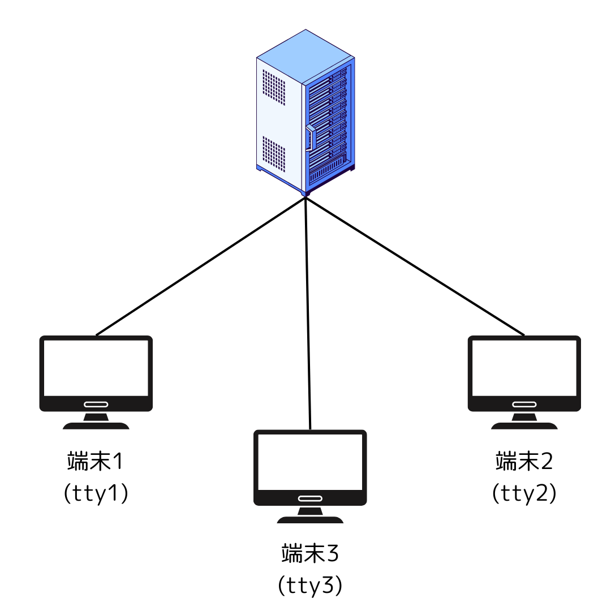

### docker run の -i オプション

- i オプション
    対象のコンテナはアタッチされていなくても、標準入力を開き続けろというコマンド  
    =>ホスト側から接続されてなくても、コンテナはキーボードからの入力を受け付ける  

iオプションなし
```bash
# iオプションなしで実行してみる
docker run -t ubunutu
# root@a70a1dd7d96f:/# 
# コマンドを入力しても、応答が返ってこない
```

iオプションあり
```bash
docker run -it ubuntu
# root@a70a1dd7d96f:/# 
# 応答あり
```

- 結論  
    i オプションはコンテナ側の標準入力からの受付を開くようなもの

---

### docker run の -t オプション

- t オプション  
    擬似ttyを割り当てる

tオプションなし
```bash
docker run -i ubuntu
# まず、プロンプトが表示されない
tty
# not a tty
```

tオプションあり
```bash
docker run -i ubuntu
# root@a70a1dd7d96f:/# 
tty
# /dev/pts/0
```

**(擬似)ttyとは**

- サーバー(PC)に接続されている端末のイメージ  


実験
```bash
# tなし
docker exec -i <コンテナ名> bash
# プロンプトが表示されない
ps -A
# PID TTY          TIME CMD
#     1 ?        00:00:00 bash
#    46 ?        00:00:00 bash
#    53 ?        00:00:00 ps

# pid=46でbashがexecされているが、ttyがわからないので、プロンプトが表示されていなかったと思う
```

```bash
# -tあり
docker exec -it <コンテナ名> bash
# プロンプトが表示される
root@a70a1dd7d96f:/# ps -A
# PID TTY          TIME CMD
#     1 ?        00:00:00 bash
#    15 pts/0    00:00:00 bash
#    56 pts/0    00:00:00 ps

pid=15が自分の端末であり、それにbashがちゃんと紐づけられているから、プロンプト表示されたと思う
```

- 超ざっくりとした結論  
    - 端末(ローカルPC)からコンテナを操作したい場合は-tオプションを忘れずつける  
    -> つけないと意図した結果が返ってこないこともある