### OCI (Open Container Initiative) 形式

- コンテナイメージフォーマットの仕様の1つ

    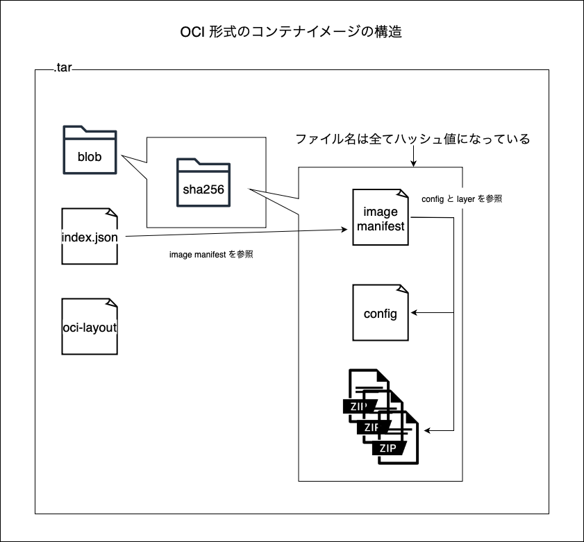

<br>
<br>

参考サイト

[コンテナイメージのアーカイブのポータビリティ](https://www.kimullaa.com/posts/202210021331/)

[オープン コンテナ イニシアティブ (OCI)：オープンコンテナの仕様を定義する](https://qiita.com/KentOhwada_AlibabaCloudJapan/items/4f8884c5f2342a8d65f4)

[手を動かして学ぶコンテナ標準 - Container Image と Container Registry 編](https://south37.hatenablog.com/entry/2020/12/10/手を動かして学ぶコンテナ標準_-_Container_Image_と_Container_Registry_編)

[OCI Artifactとはなんぞや？というお話](https://tech.nri-net.com/entry/what_is_an_oci_artifact)

---

### Docker (docker-archieve) 形式

- Docker が定めるコンテナイメージフォーマットの仕様

- Docker 25 にて docker-archieve 形式は OCI と互換性があるように以下の形式になったらしい

    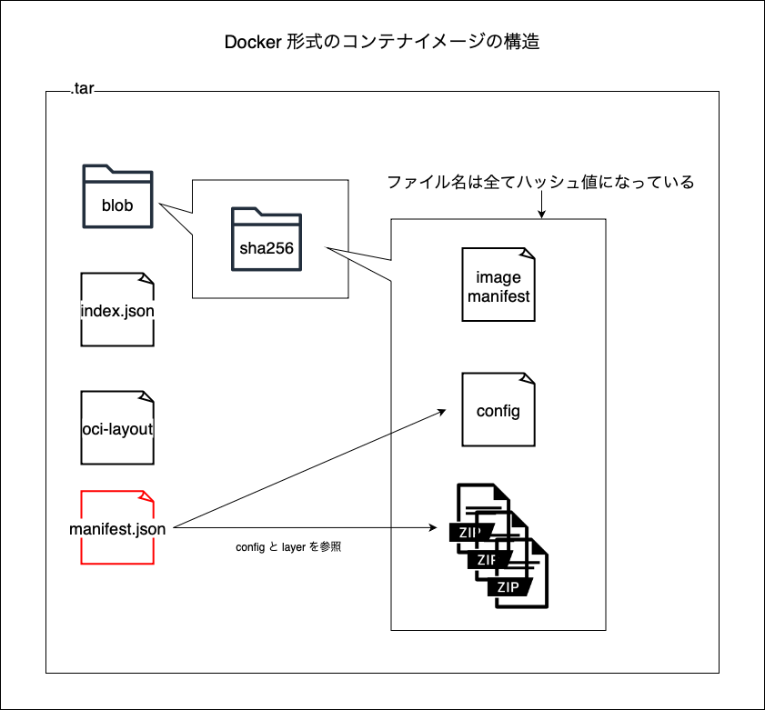

<br>
<br>

参考サイト

[Dockerイメージの中身を理解する](https://tech-blog.rakus.co.jp/entry/20231003/docker)

[Dockerコンテナのレイヤ構造とは？](https://qiita.com/okmtz/items/f8231c83134a6363647b)

---

### index.json

- OCI イメージのエントリーポイント

- [Image Manifest](#image-manifest) への参照などが定義されている

    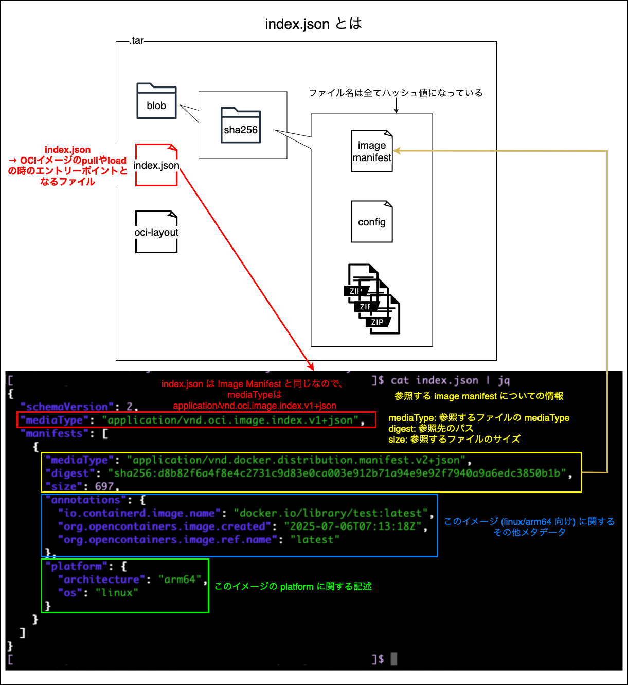

---

### Manifest.json

- Docker イメージのエントリーポイント (Docker 版 [image manifest](#image-manifest) のイメージ)

- [configファイル](#config)と [layers](#layers) への参照が定義されている

    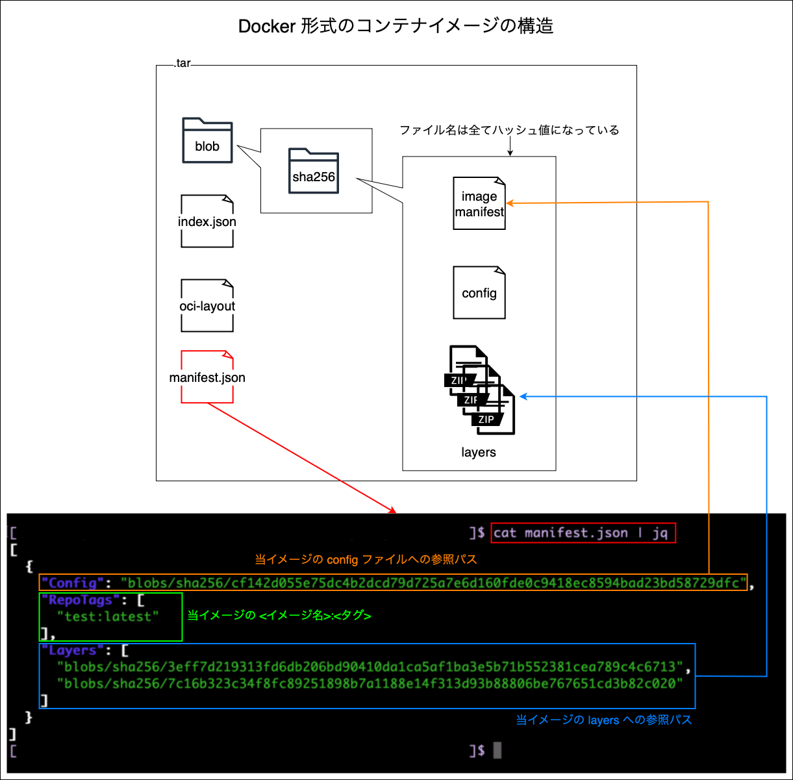

---

### Image Manifest

- OCI 版 [Manifest.json](#manifestjson) みたいなもの

- manifest.json と同様に [configファイル](#config)と [layers](#layers) への参照が定義されている

    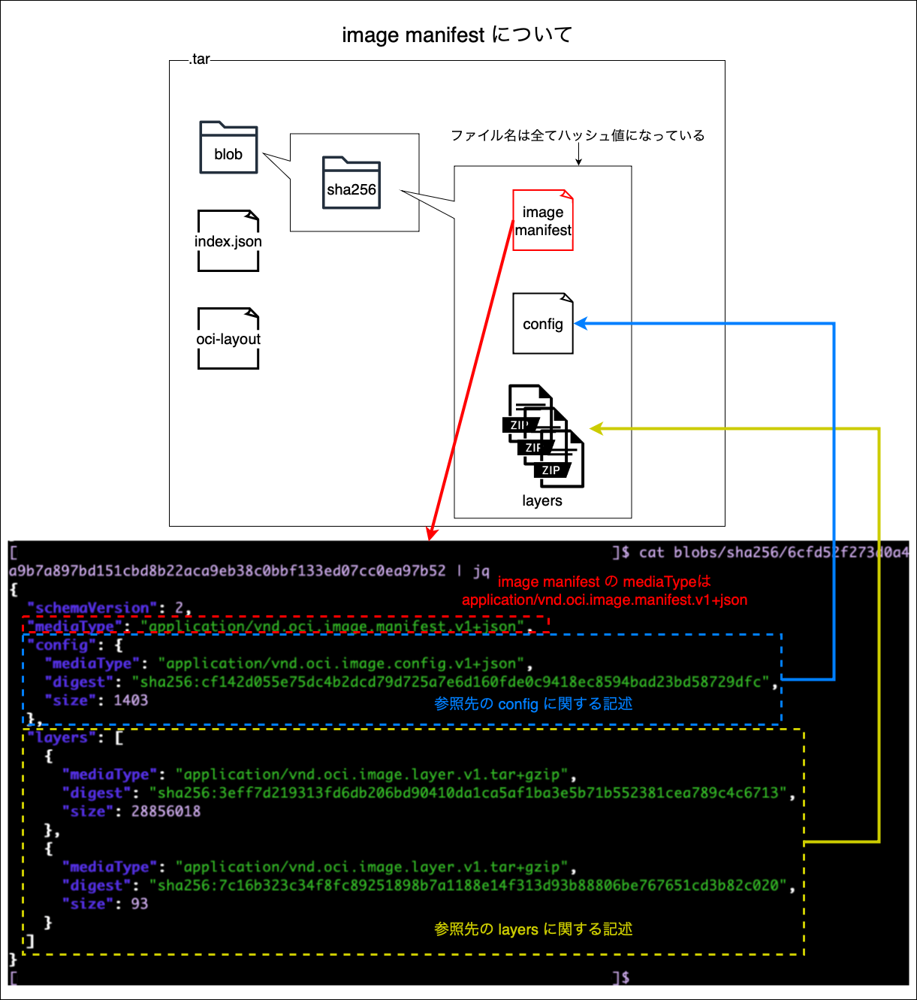

    <br>

- マルチプラットフォームビルドされたイメージの場合、それぞれの CPU アーキテクチャごとに Image Manifest が生成される

---

### Config

- コンテナイメージの構成に関する情報を持つファイル

    - 環境変数や、イメージが作成されたタイムスタンプなども持つ

    - コンテナのファイルシステムへの変更履歴も持つ

    

---

### Layers

- 各レイヤーのコンテナイメージのファイルシステムへの変更が含まれている

    

<br>

- このイメージを元にコンテナを実行する際は、イメージの各レイヤーを順にスタックし（Union Mount）、統合された仮想的なコンテナのファイルシステムを構築する

    - また、一番上にコンテナ専用の読み書き可能（writable）なコンテナレイヤーが追加される

        

        引用: [コンテナのレイヤー構造を理解する](https://offshore.craid-inc.com/container-layered-file-system/)

<br>
<br>

参考サイト

[コンテナのレイヤー構造を理解する](https://offshore.craid-inc.com/container-layered-file-system/)

[Dockerコンテナのレイヤ構造とは？](https://qiita.com/okmtz/items/f8231c83134a6363647b)

[イメージレイヤーの理解](https://matsuand.github.io/docker.docs-ja/get-started/docker-concepts/building-images/understanding-image-layers/)

---

### Image Index

- ★複数の [Image Manifest](#image-manifest) を管理するドキュメント

- マルチプラットフォームイメージなどに含まれる

    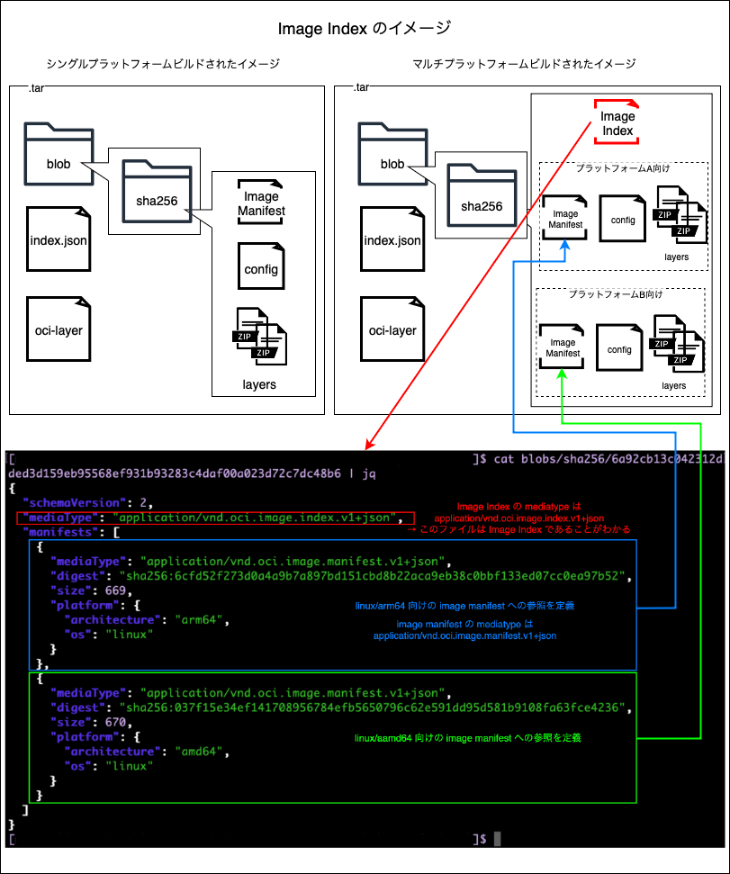

    <br>

- 実は [index.json](#indexjson) も Image Index

    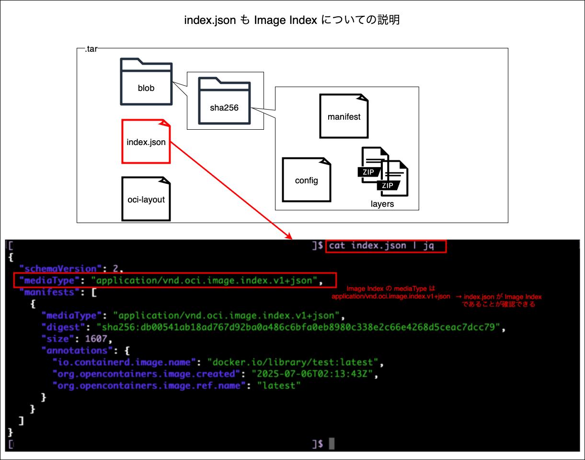

---

### Attestaion (provenance)

- ★ビルドの来歴情報 (Docker イメージのビルド時に、そのイメージがどのように構築されたか等の情報)

- provenance 情報は、**attestation manifest**、**config**、**layers** から構成される

- attestation manifest は [image manifest](#image-manifest) と同じ構造。通常の imamge manifest と attestation manifest を管理するために [image index](#image-index) も作成される

    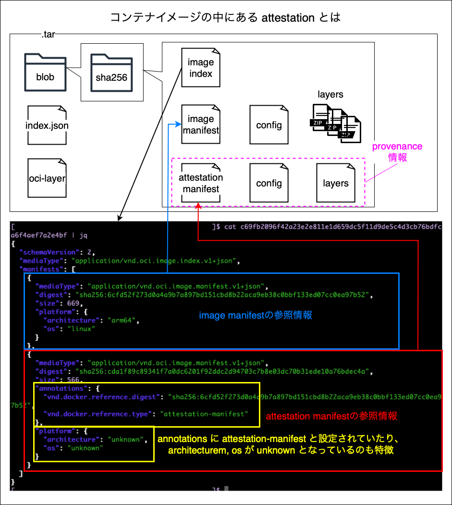

    <br>

- attestation manifest の構造は image manifest と同じで、config と layers への参照を持つ

    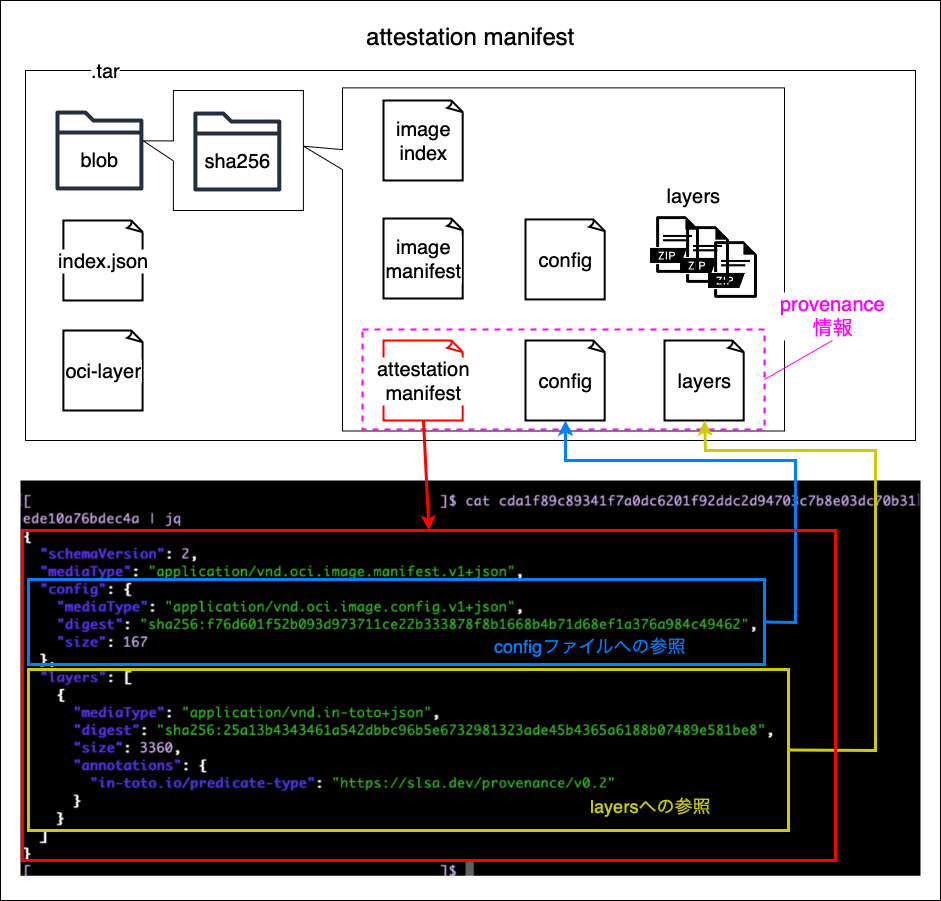

    <br>

- ★config は attestation manifest が image manifest としての形式を保つ上で必要なファイルであり、config ファイル自体に意味はない

    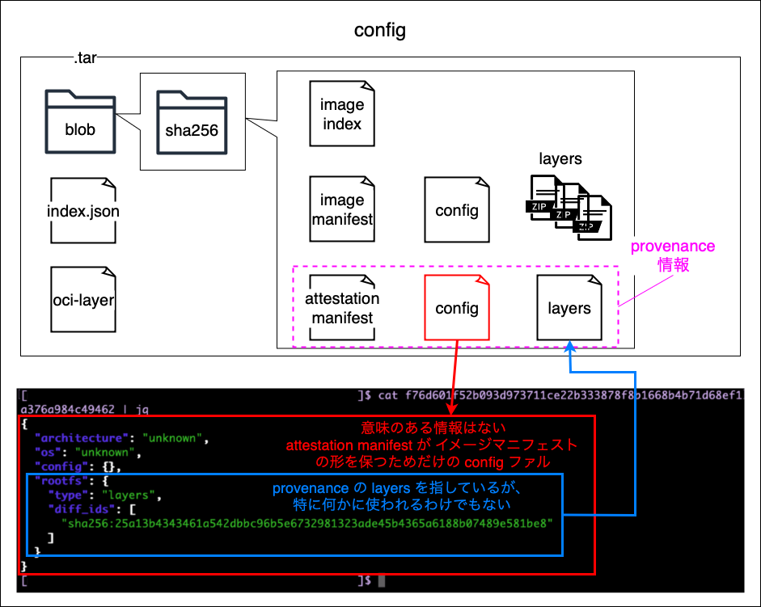

    <br>

- ★layers は in-toto 形式の JSON ファイル。このファイルに、ビルドの来歴情報が保存されている

    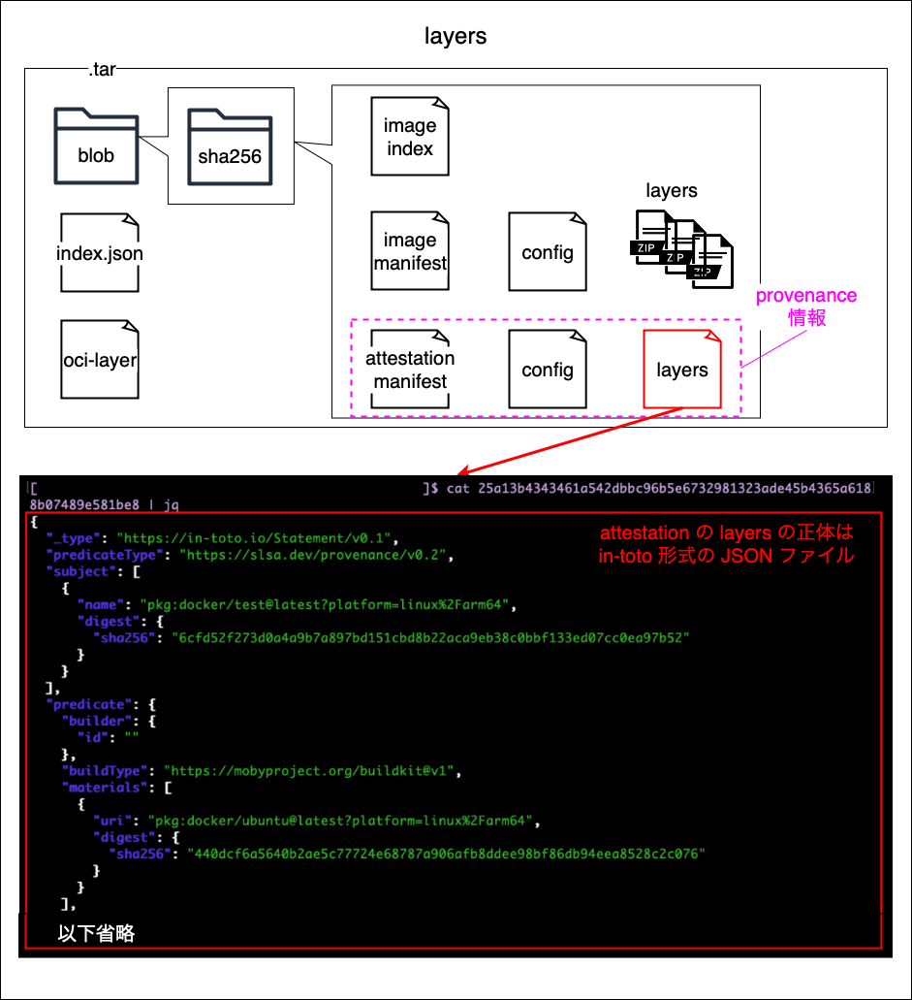

    <br>

    - in-toto 形式とはソフトウェアのサプライチェーン（ビルドの来歴や配布の流れ）の完全性と信頼性を証明するためのドキュメントの仕様

        

<br>

- マルチプラットフォームビルドされたイメージには、プラットフォームごとに provenance 情報が出力される

    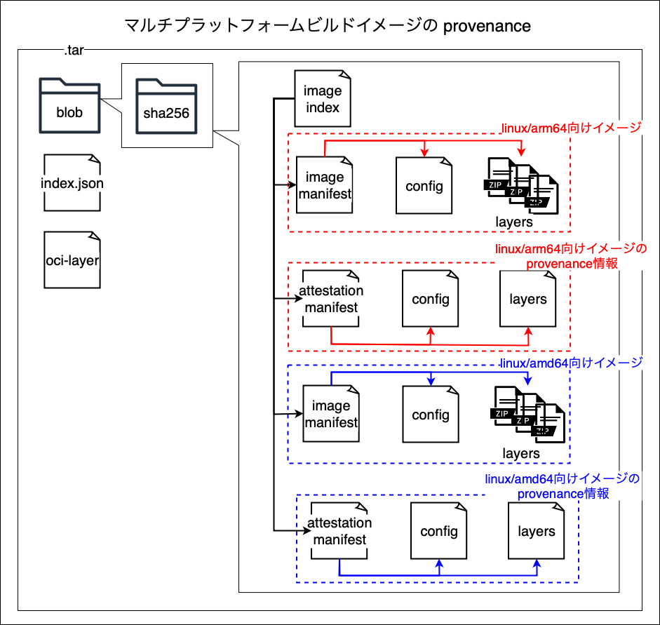

<br>
<br>

参考サイト

[ECRにイメージが複数作成されてしまい、Lambdaにデプロイできない問題](https://qiita.com/har1101/items/40717ac600559a6cb1bb#provenanceオプションとは)

---

### OCI Content Descriptor

- コンテンツ（レイヤーやマニフェスト、構成ファイルなど）を参照・識別・検証するための情報を持つJSONオブジェクト (の書き方)

    

    <br>

- ざっくり言うと、[image manifest](#image-manifest) や [image index](#image-index) 中での、他ファイルへの参照の書き方

    

    <br>

- mediaType から参照先のコンテンツの種類がわかる

    

<br>
<br>

参考サイト

[OCI Content Descriptors](https://github.com/opencontainers/image-spec/blob/main/descriptor.md)

---

### Local Image Store

- local image store = `Docker images` などで確認できるイメージが保存されている場所

<br>
<br>

### 勘違いしていたこと

- Docker Desktop > Settings > Resources > Advanced > Disk image location に指定されている場所が Local Image Store だと勘違いしていた

    - Disk image location が指しているのは Docker が動く Linux VM のディスクイメージの場所

        

<br>
<br>

### Local Image Store に保存されているイメージの構造

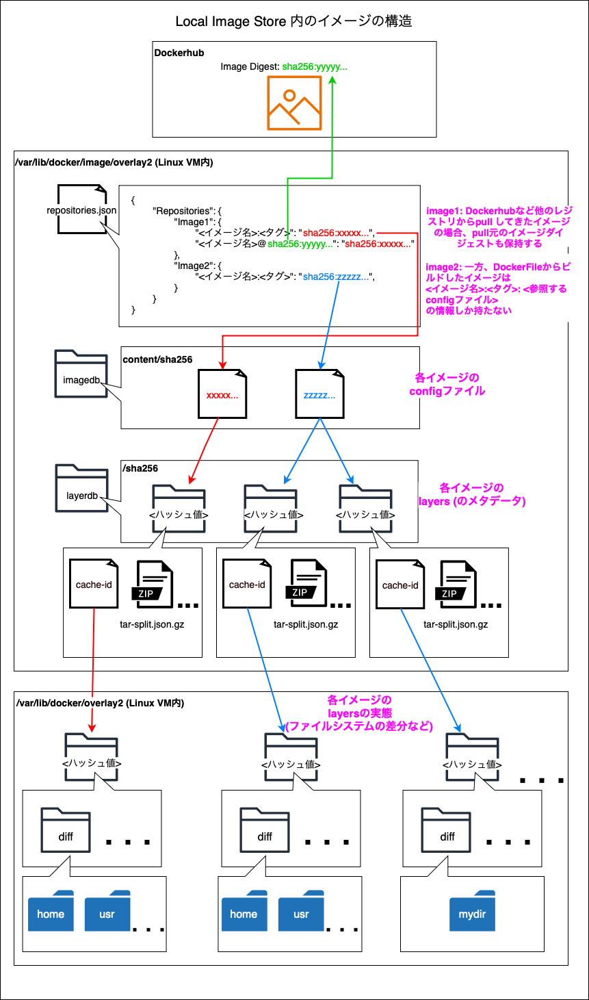

<br>

- repositories.json にイメージの config への参照が定義されている

<br>

- `/var/lib/docker/image/overlay2/imagedb/content/sha256` に config ファイルが配置されている

    - config ファイルは、コンテナイメージの構成に関する情報や、**layers のメタデータへの参照**が定義されている

<br>

- `/var/lib/docker/image/overlay2/layerdb/sha256` にイメージの layers の**メタデータ**が配置されている

    - cahce-id にそのイメージの layers の実態 (`/var/lib/docker/overlay2` にあるディレクトリ) への参照情報が格納されている

    - tar-split.json.gz はイメージが docker save コマンドなどによって外部ファイル (oci形式やdocker-archieve形式) として出力される際に、そのイメージアーカイブの layers (tar圧縮)を生成するために使われる gzip 圧縮された JSONファイル

        

<br>

- `/var/lib/docker/overlay2` にイメージの layers の実態がある

    - diff ディレクトリに layers の実態となるファイルシステムの差分がある

<br>

- ★local image store では [image manifest](#image-manifest) は持たない

    - `docker save` や `docker build` コマンドで外部ファイル (docker-archieve 形式や oci 形式) に出力する際に、 local image store の config や layers を元に image manifest が作成される

<br>
<br>

### Local Image Store に保管されているイメージの確認

1. Docker が動いている Linux VM にアクセスする

    ```docker
    docker run --rm -it --privileged --pid=host justincormack/nsenter1
    ```

<br>

2. repositories.json の中身を確認

    ```
    /var/lib/docker/image/overlay2
      |
      |-- distribution
      |-- imagedb
      |-- layerdb
      |-- repositories.json ★ここをチェック
    ```

    <br>

    

<br>

3. 上記手順で確認した repositories.json で参照されていた **config ファイル**を確認する

    ```
    /var/lib/docker/image/overlay2/imagedb
      |-- metadata
      |-- content
            |-- sha256
                  |-- xxxxxxxx... (ハッシュ値)
    ```

    <br>

    

<br>

4. 上記手順で確認した config ファイル中の diff_id で指定されている **layers** を確認する

    ```
    /var/lib/docker/image/overlay2/layerdb
      |-- mounts
      |-- tmp
      |-- sha256
            |-- dcb775... (ハッシュ値)
    ```

    

<br>

5. cache-id ファイルの中身を確認し、**layers の実態** への参照情報を確認する
   
    

<br>

6. `/var/lib/docker/overlay2` にある layers の実態を確認する

    ```
    /var/lib/docker/overlay2
        |-- <ハッシュ値> (layers の実態)
    ```

    

<br>

7. diff ディレクトリの中身を確認するとファイルシステムの差分であることがわかる

    